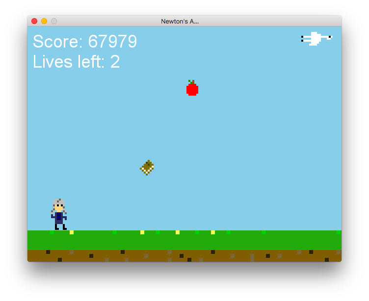

## Newton's Apple

Use the wind to stop Newton getting that apple!

Stupid little Flappy Bird-esque game done for first year programming module at
university.



### Prerequisities

Needs [Allegro](http://liballeg.org) libraries installed.

On Ubuntu 15.10:

```
sudo apt-get -y install liballegro5-dev portaudio19-dev
```

On OS X;

```
brew install allegro portaudio
```

### Compiling

```
make
```
